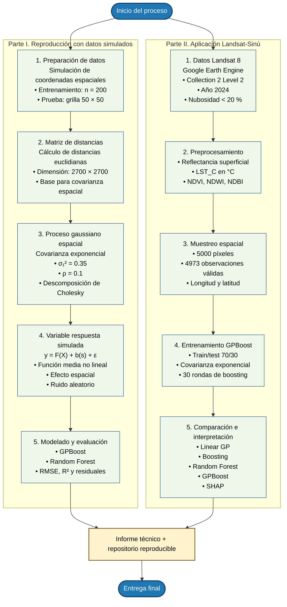

# Examen 2 - GPBoost para datos espaciales y percepción remota

Repositorio del Examen No. 2 del curso de Percepción Remota.

Este proyecto reproduce una aplicación del algoritmo GPBoost para datos espaciales simulados y desarrolla una aplicación propia con datos Landsat 8 en la cuenca del río Sinú.

## Autores

- Sebastian Velosa Bohórquez
- Viviana Andrea Peña González

## Descripción general

El trabajo se divide en dos partes:

1. Reproducción del ejercicio base de GPBoost con datos espaciales simulados.
2. Aplicación de GPBoost a datos derivados de Landsat 8 Collection 2 Level 2 para modelar la temperatura superficial terrestre en la cuenca del río Sinú.

La primera parte permite evaluar el comportamiento de GPBoost en un escenario controlado, donde la variable respuesta se genera como la suma de una función media no lineal, un proceso gaussiano espacial y un término de error aleatorio.

La segunda parte utiliza datos obtenidos en Google Earth Engine para construir un conjunto de muestras con bandas de reflectancia superficial, índices espectrales, coordenadas geográficas y temperatura superficial terrestre.

## Flujo metodológico



## Estructura del repositorio

```text
Examen2_RS_SVB_VAPG/
│
├── README.md
├── requirements.txt
│
├── data/
│   ├── sinu_landsat_lst_gpboost_samples.csv
│   ├── X_train.csv
│   ├── X_test.csv
│   ├── y_train.csv
│   ├── y_test.csv
│   ├── coords_train.csv
│   └── coords_test.csv
│
├── notebooks/
│   ├── 01_reproduccion_gpboost.ipynb
│   ├── 02_aplicacion_cuenca_sinu.ipynb
│   └── aquivan los notebooks.txt
│
├── models/
│   └── gpboost_sinu.model
│
├── outputs/
│   ├── figures/
│   │   ├── 1. Distribucion espacial de la LST.png
│   │   ├── 2. Histograma de variables.png
│   │   ├── 3. Matriz de Correlacion.png
│   │   ├── 9.1 Gráfico observado vs Predicho.png
│   │   ├── 9.2 Importancia de Variables.png
│   │   ├── 9.3 Visualizacion efecto espacial GP Boost.png
│   │   ├── 9.4 Grafico_Incertidumbre Espacial del GP.png
│   │   ├── 9.5 Componente no lineal aprendida por boosting.png
│   │   ├── 9.6 Gráfico resumen SHAP.png
│   │   ├── 9.6b Grafico de dependecia SHAP - NDVI.png
│   │   ├── 9.9 Tabla comparacion modelos.PNG
│   │   └── 9.9 b Grafico comparativo RMSE.png
│   │
│   └── tables/
│       └── tabla_comparacion_modelos.csv
│
├── gee/
│
└── report/
```

## Notebooks

### `01_reproduccion_gpboost.ipynb`

Notebook de reproducción del ejercicio base de GPBoost con datos espaciales simulados.

Incluye:

- generación de coordenadas espaciales simuladas;
- construcción de una matriz de distancias euclidianas;
- simulación de un proceso gaussiano espacial;
- construcción de una variable respuesta \(y = F(X) + b(s) + \varepsilon\);
- entrenamiento de GPBoost;
- ajuste de hiperparámetros;
- comparación con Random Forest;
- evaluación mediante RMSE, R², mapas de residuales y error absoluto local.

Resultados principales:

| Modelo | RMSE | R² |
|---|---:|---:|
| GPBoost ajustado | 0.583 | 0.874 |
| Random Forest | 0.716 | 0.810 |

### `02_aplicacion_cuenca_sinu.ipynb`

Notebook de aplicación de GPBoost con datos Landsat 8 en la cuenca del río Sinú.

Incluye:

- carga del dataset exportado desde Google Earth Engine;
- análisis exploratorio de variables espectrales;
- visualización espacial de temperatura superficial terrestre;
- entrenamiento de GPBoost;
- separación de componentes del modelo: efecto fijo, efecto espacial e incertidumbre;
- interpretación mediante importancia de variables y SHAP;
- comparación con Linear GP, Boosting y Random Forest.

Resultados principales:

| Modelo | RMSE | R² |
|---|---:|---:|
| Linear GP | 1.905 | 0.898 |
| Boosting | 2.562 | 0.815 |
| Random Forest | 2.357 | 0.844 |
| GPBoost | 2.243 | 0.858 |

## Datos

El archivo principal de datos es:

```text
data/sinu_landsat_lst_gpboost_samples.csv
```

Este archivo contiene muestras generadas en Google Earth Engine a partir de Landsat 8 Collection 2 Level 2 para la cuenca del río Sinú durante el año 2024.

Variables principales:

| Variable | Descripción |
|---|---|
| `SR_B2` | Banda azul |
| `SR_B3` | Banda verde |
| `SR_B4` | Banda roja |
| `SR_B5` | Infrarrojo cercano |
| `SR_B6` | SWIR1 |
| `SR_B7` | SWIR2 |
| `NDVI` | Índice de Vegetación de Diferencia Normalizada |
| `NDWI` | Índice Normalizado de Agua |
| `NDBI` | Índice Diferencial Normalizado de Áreas Construidas |
| `LST_C` | Temperatura superficial terrestre en grados Celsius |
| `latitude` | Latitud |
| `longitude` | Longitud |

El conjunto de datos final contiene 4973 observaciones válidas.

Los archivos `X_train.csv`, `X_test.csv`, `y_train.csv`, `y_test.csv`, `coords_train.csv` y `coords_test.csv` corresponden a la partición de entrenamiento y prueba utilizada para el modelado.

## Google Earth Engine

La carpeta `gee/` está destinada a almacenar el script usado para generar las muestras Landsat.

Flujo aplicado en Google Earth Engine:

1. Cargar el polígono de la cuenca del río Sinú.
2. Filtrar Landsat 8 Collection 2 Level 2 para el año 2024.
3. Aplicar filtro de nubosidad menor al 20 %.
4. Escalar bandas ópticas a reflectancia superficial.
5. Convertir la banda térmica `ST_B10` a temperatura superficial terrestre en grados Celsius.
6. Calcular NDVI, NDWI y NDBI.
7. Agregar coordenadas geográficas.
8. Exportar una muestra aleatoria de 5000 píxeles a CSV.

## Resultados generados

La carpeta `outputs/figures/` contiene las figuras utilizadas para el análisis y el informe.

Figuras principales:

- distribución espacial de LST;
- histogramas de variables;
- matriz de correlación;
- gráfico observado vs. predicho;
- importancia de variables;
- efecto espacial estimado por GPBoost;
- incertidumbre espacial;
- componente no lineal aprendida por boosting;
- gráfico resumen SHAP;
- gráfico de dependencia SHAP para NDVI;
- comparación de modelos;
- gráfico comparativo de RMSE.

La carpeta `outputs/tables/` contiene tablas de resultados, incluyendo:

```text
outputs/tables/tabla_comparacion_modelos.csv
```

## Modelo guardado

La carpeta `models/` contiene el modelo GPBoost entrenado para la aplicación de la cuenca del río Sinú:

```text
models/gpboost_sinu.model
```

Este archivo permite conservar el modelo entrenado sin repetir el entrenamiento completo.

## Instalación de dependencias

Crear un entorno de Python e instalar las dependencias:

```bash
pip install -r requirements.txt
```

Contenido sugerido para `requirements.txt`:

```text
gpboost
pandas
numpy
matplotlib
seaborn
scikit-learn
shap
gdown
jupyter
```

## Ejecución

Clonar el repositorio:

```bash
git clone <URL_DEL_REPOSITORIO>
cd Examen2_RS_SVB_VAPG
```

Instalar dependencias:

```bash
pip install -r requirements.txt
```

Abrir los notebooks:

```bash
jupyter notebook
```

Orden sugerido de ejecución:

```text
notebooks/01_reproduccion_gpboost.ipynb
notebooks/02_aplicacion_cuenca_sinu.ipynb
```

También pueden ejecutarse directamente en Google Colab.

## Informe

El informe final se encuentra en la carpeta:

```text
report/
```

El documento resume la reproducción del algoritmo GPBoost, la aplicación Landsat en la cuenca del río Sinú, los resultados comparativos, la discusión y las principales limitaciones del ejercicio.

## Referencias principales

- Sigrist, F. “Tree Boosting for Spatial Data.” Towards Data Science / Medium.
- Sigrist, F. “Gaussian Process Boosting.” Journal of Machine Learning Research, 2022.
- Sigrist, F. “Latent Gaussian Model Boosting.” IEEE Transactions on Pattern Analysis and Machine Intelligence, 2023.
- U.S. Geological Survey. “Landsat 8-9 Collection 2 Level 2 Science Products.”
- Google Earth Engine Documentation.
- Pedregosa et al. “Scikit-learn: Machine Learning in Python.” Journal of Machine Learning Research, 2011.

## Nota

Este repositorio corresponde a un ejercicio académico. Los resultados de la aplicación Landsat-Sinú deben interpretarse como una evaluación metodológica y computacional del flujo Google Earth Engine - Colab - GPBoost, no como una validación física completa de temperatura superficial terrestre en campo.